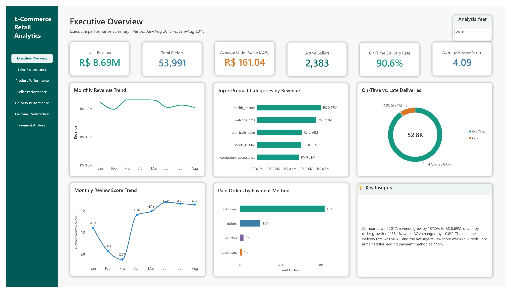
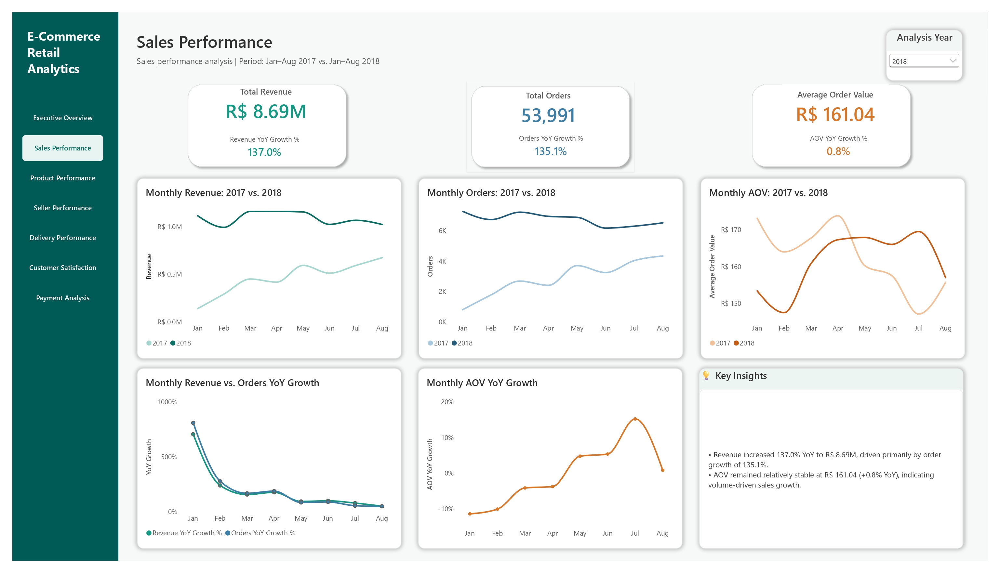
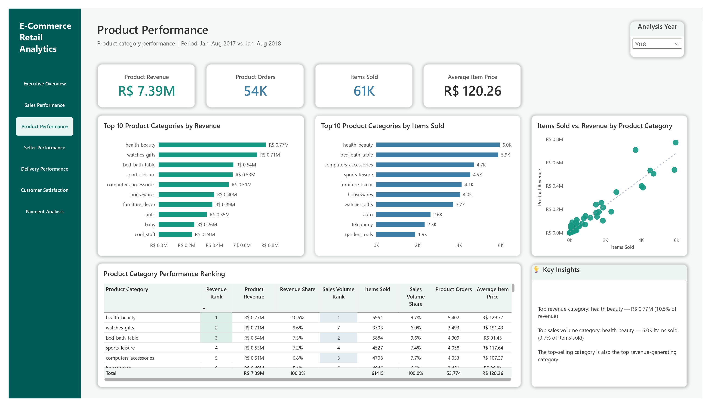
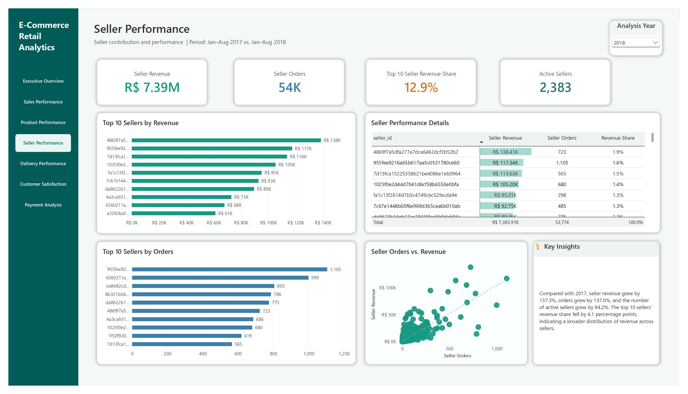
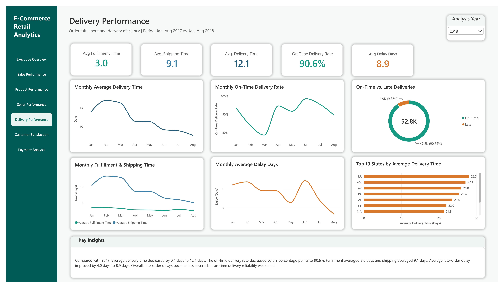
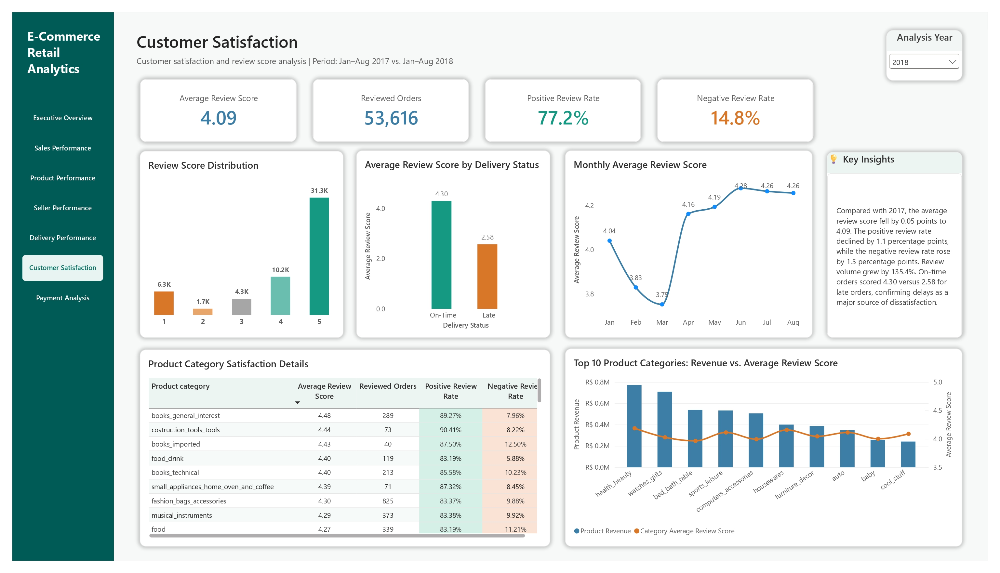
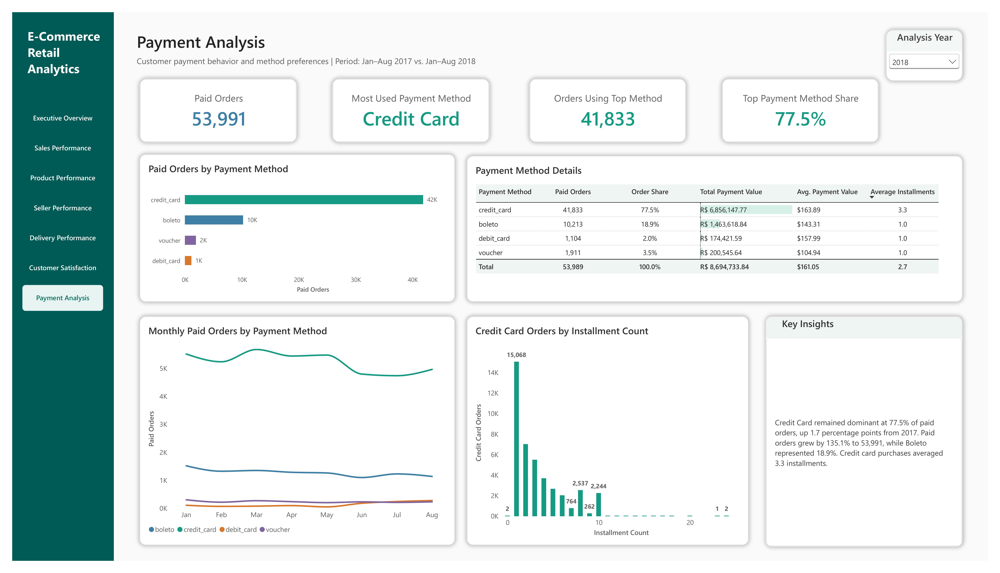

# E-Commerce Retail Business Analytics

This project is an end-to-end business intelligence solution built using the Brazilian Olist e-commerce dataset.

The main goal is to evaluate sales growth, product and seller performance, delivery efficiency, customer satisfaction, and payment behavior using **Python**, **SQL**, and **Power BI**.

The primary analysis compares:

- **January–August 2017**
- **January–August 2018**

Using equivalent periods ensures a consistent year-over-year comparison.



---

## Business Questions

This project answers six main business questions:

1. **How did sales performance change over time?**
2. **Which product categories generated the highest revenue and sales volume?**
3. **Which sellers contributed most to the marketplace?**
4. **How efficiently were orders fulfilled and delivered?**
5. **How satisfied were customers, and how did delivery performance relate to review scores?**
6. **Which payment methods were most commonly used by customers?**

---

## Dataset Overview

This project uses the public [Brazilian E-Commerce Public Dataset by Olist](https://www.kaggle.com/datasets/olistbr/brazilian-ecommerce).

The dataset contains approximately 100,000 marketplace orders and includes information about:

- customers
- orders
- order items
- products
- sellers
- payments
- reviews
- delivery timelines
- geographic locations
- product-category translations

### Main table grains

- **Customers:** one row per customer record
- **Orders:** one row per order
- **Order Items:** one row per item within an order
- **Payments:** one row per payment record associated with an order
- **Reviews:** one row per review record
- **Products:** one row per product
- **Sellers:** one row per seller

Raw source files are excluded from this repository and can be downloaded from the dataset link above.

---

## Tools & Technologies

- **Python**
  - pandas
  - Jupyter Notebook
- **MySQL**
- **SQL**
- **DBeaver**
- **Power BI**
  - Power Query
  - Data modeling
  - DAX
  - Interactive reporting
- **VS Code**
- **Git & GitHub**

---

## Project Workflow

### 1) Business Understanding

- Defined the analytical objective
- Identified six business questions
- Selected the KPIs, tables, and columns required for each analysis

### 2) Data Understanding

- Loaded nine source tables
- Assessed dataset structure and completeness
- Identified candidate keys
- Validated relationships between tables
- Documented the grain of each dataset

### 3) Data Preparation

- Assessed fully duplicated records
- Investigated missing values using business context
- Validated order-lifecycle timestamps
- Converted date columns to appropriate datetime types
- Checked business consistency rules
- Preserved raw source files without overwriting them

### 4) SQL Analysis & Validation

- Analyzed sales, products, sellers, delivery, reviews, and payments
- Used SQL to validate Power BI KPIs
- Compared equivalent January–August periods
- Excluded incomplete final months from the main year-over-year analysis

### 5) Power BI Development

- Built the data model and relationships
- Created DAX measures for business KPIs
- Added a shared year filter
- Designed seven consistent dashboard pages
- Added dynamic key insights and report navigation

### 6) Documentation & Version Control

- Documented the analytical workflow in Jupyter Notebooks
- Organized SQL scripts by analysis and validation purpose
- Tracked project development through Git commits
- Exported final dashboard pages for portfolio presentation

---

## Dashboard Overview

The final Power BI report contains seven pages:

1. Executive Overview
2. Sales Performance
3. Product Performance
4. Seller Performance
5. Delivery Performance
6. Customer Satisfaction
7. Payment Analysis

The complete Power BI report is available here:

[`powerbi/ecommerce_retail_analytics.pbix`](powerbi/ecommerce_retail_analytics.pbix)

---

## 2018 KPI Summary

| KPI | Jan–Aug 2018 |
| --- | ---: |
| Total Revenue | R$ 8.69M |
| Total Orders | 53,991 |
| Average Order Value | R$ 161.04 |
| Active Sellers | 2,383 |
| On-Time Delivery Rate | 90.6% |
| Average Review Score | 4.09 |
| Credit Card Order Share | 77.5% |

---

## Key Findings

### 1) Sales growth was primarily driven by order volume

Revenue increased by **137.0%** year over year to **R$ 8.69M**, while total orders increased by **135.1%**.

Average order value increased by only **0.8%** to **R$ 161.04**, indicating that sales growth was mainly volume-driven rather than value-driven.

### 2) Health & Beauty was the leading product category

`health_beauty` generated approximately **R$ 0.77M** in product revenue and sold about **6.0K items**, ranking first in both revenue and sales volume.

`watches_gifts` ranked second by revenue, while `bed_bath_table` ranked second by items sold.

### 3) Revenue became more broadly distributed across sellers

The marketplace had **2,383 active sellers** during January–August 2018.

The top 10 sellers generated **12.9%** of seller revenue. Their share declined compared with 2017, indicating that revenue was distributed across a broader seller base.

### 4) Delivery speed improved, but on-time reliability weakened

Average delivery time was **12.1 days**, consisting of approximately:

- **3.0 days** for fulfillment
- **9.1 days** for shipping

Although average delivery time improved slightly, the on-time delivery rate declined by **5.2 percentage points** to **90.6%**.

For late orders, average delay severity improved to **8.9 days**.

### 5) Late delivery had a strong relationship with customer dissatisfaction

The overall average review score was **4.09**.

- Positive review rate: **77.2%**
- Negative review rate: **14.8%**
- Average score for on-time orders: **4.30**
- Average score for late orders: **2.58**

The large gap between on-time and late orders confirms that delivery reliability is an important driver of customer satisfaction.

### 6) Credit cards dominated customer payment behavior

Credit cards were used for **77.5%** of paid orders, representing **41,833 orders**.

`boleto` was the second most common payment method with an **18.9%** share. Credit-card purchases used an average of **3.3 installments**.

---

## Main Insight

> **The marketplace achieved strong volume-driven growth, but delivery reliability and customer satisfaction did not improve at the same pace.**

The main business opportunity is to maintain sales growth while strengthening delivery reliability—particularly because late deliveries were associated with substantially lower review scores.

---

## Dashboard Pages

<details>
<summary><strong>1. Executive Overview</strong></summary>

<br>


</details>

<details>
<summary><strong>2. Sales Performance</strong></summary>

<br>



</details>

<details>
<summary><strong>3. Product Performance</strong></summary>

<br>



</details>

<details>
<summary><strong>4. Seller Performance</strong></summary>

<br>



</details>

<details>
<summary><strong>5. Delivery Performance</strong></summary>

<br>



</details>

<details>
<summary><strong>6. Customer Satisfaction</strong></summary>

<br>



</details>

<details>
<summary><strong>7. Payment Analysis</strong></summary>

<br>



</details>

---

## Analysis Techniques Used

- Business-question definition
- Dataset inventory and structural assessment
- Candidate-key validation
- Relationship and table-grain analysis
- Missing-value assessment
- Duplicate assessment
- Business consistency validation
- SQL aggregation and KPI validation
- Year-over-year comparison
- Ranking and contribution analysis
- Trend analysis
- DAX measure development
- Interactive dashboard design
- Business insight communication

---

## Project Structure

```text
ecommerce-retail-analytics/
│
├── data/
│   └── processed/
│       └── reviews_sql.csv
│
├── docs/
│   └── project_brief.md
│
├── images/
│   └── dashboard/
│       ├── 01_executive_overview.jpg
│       ├── 02_sales_performance.jpg
│       ├── 03_product_performance.jpg
│       ├── 04_seller_performance.jpg
│       ├── 05_delivery_performance.jpg
│       ├── 06_customer_satisfaction.jpg
│       └── 07_payment_analysis.jpg
│
├── notebooks/
│   ├── 01_project_definition.ipynb
│   ├── 02_data_understanding.ipynb
│   └── 03_data_preparation.ipynb
│
├── powerbi/
│   └── ecommerce_retail_analytics.pbix
│
├── scripts/
│   └── prepare_reviews_for_sql.py
│
├── sql/
│   ├── analysis/
│   │   ├── 01_sales_performance_analysis.sql
│   │   ├── 02_product_performance_analysis.sql
│   │   ├── 03_seller_performance_analysis.sql
│   │   ├── 04_delivery_performance_analysis.sql
│   │   ├── 05_customer_satisfaction_analysis.sql
│   │   └── 06_payment_analysis.sql
│   │
│   └── validation/
│       ├── 01_validate_total_orders.sql
│       ├── 02_validate_total_revenue.sql
│       └── 03_validate_average_order_value.sql
│
├── .gitignore
├── LICENSE
├── README.md
└── requirements.txt
```

---

## File Description

- **`notebooks/01_project_definition.ipynb`**  
  Defines the business goal, analytical questions, KPIs, and data requirements.

- **`notebooks/02_data_understanding.ipynb`**  
  Documents dataset inventory, structure, candidate keys, relationships, and table grains.

- **`notebooks/03_data_preparation.ipynb`**  
  Assesses duplicates, missing values, data types, and business consistency.

- **`scripts/prepare_reviews_for_sql.py`**  
  Creates the processed review dataset required for SQL analysis.

- **`sql/analysis/`**  
  Contains SQL queries for the six main analytical areas.

- **`sql/validation/`**  
  Contains focused SQL checks used to validate core Power BI KPIs.

- **`powerbi/ecommerce_retail_analytics.pbix`**  
  Contains the complete interactive Power BI report.

- **`images/dashboard/`**  
  Contains exported images of all final dashboard pages.

- **`docs/project_brief.md`**  
  Documents the final project scope, business questions, tools, and deliverables.

- **`LICENSE`**  
  Defines the terms for using, modifying, and distributing the project code and documentation under the MIT License.
---

## How to Use This Repository

### 1. Clone the repository

```bash
git clone https://github.com/ParisaSolouki/ecommerce-retail-analytics.git
cd ecommerce-retail-analytics
```

### 2. Install the Python dependencies

```bash
pip install -r requirements.txt
```

### 3. Download the raw dataset

Download the Olist dataset from Kaggle and place the source CSV files inside:

```text
data/raw/
```

The raw files are intentionally excluded from GitHub.

### 4. Review the analytical workflow

Open the notebooks in numerical order:

```text
01_project_definition.ipynb
02_data_understanding.ipynb
03_data_preparation.ipynb
```

### 5. Prepare the review dataset for SQL

```bash
python scripts/prepare_reviews_for_sql.py
```

### 6. Run the SQL analysis

Import the required Olist tables into MySQL, then execute the scripts in:

```text
sql/analysis/
sql/validation/
```

### 7. Open the Power BI report

Open the following file in Power BI Desktop:

```text
powerbi/ecommerce_retail_analytics.pbix
```

---

## Possible Next Steps

Potential future improvements include:

- Adding geographic sales and delivery analysis
- Investigating repeat-customer behavior
- Developing customer segmentation
- Adding product-level profitability analysis
- Creating sales and delivery forecasts
- Publishing the report through Power BI Service
- Automating the data-refresh workflow

---

## Why I Built This Project

I built this project to demonstrate my ability to deliver an end-to-end business intelligence solution using a real-world e-commerce dataset.

The project was designed to reflect a professional analytics workflow—from defining business questions and assessing data quality to validating KPIs with SQL, developing an interactive Power BI report, and translating analytical results into clear business insights.

It demonstrates my ability to combine Python, SQL, data modeling, DAX, dashboard design, and business communication within a single portfolio project.

---

## Usage

This repository presents an end-to-end business intelligence portfolio project developed using the Olist e-commerce dataset.

The analysis, SQL queries, documentation, and dashboard are provided to demonstrate the complete analytical workflow and may be referenced with appropriate credit.

---

## License

The code, SQL queries, notebooks, and project documentation in this repository are licensed under the [MIT License](LICENSE).

The Olist dataset is not included in this repository and remains subject to the terms and conditions of its original source.

---